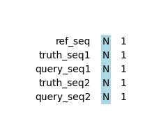

# Example `empty`
## Reference sequences
```
>mock
NNNNNNNNNNNNNNNNNNNNNNNNNNNNNNNNNNNNNNNNNNNNNNNNNN
AAAAAAAAAAAAAAAAAAAAAAAAAAAAAAAAAAAAAAAAAAAAAAAAAA
NNNNNNNNNNNNNNNNNNNNNNNNNNNNNNNNNNNNNNNNNNNNNNNNNN
```
## Truth variants
```
#CHROM	POS	ID	REF	ALT	QUAL	FILTER	INFO	FORMAT	truth
mock	51	.	A	C	40	.	.	GT	0/0
```
## Query variants
```
#CHROM	POS	ID	REF	ALT	QUAL	FILTER	INFO	FORMAT	query
mock	51	.	A	C	40	.	.	GT	0/0
```
## Output summary
Variant Type | Metric | Hap.py-GT | Aardvark-GT | Aardvark-Basepair
:-- | :-- | --: | --: | --:
ALL | F1 | -- |  | 
ALL | Recall | -- |  (0/0) |  (0/0)
ALL | Precision | -- |  (0/0) |  (0/0)
SNV | F1 |  | -- | --
SNV | Recall |  (0/0) | -- | --
SNV | Precision |  (0/0) | -- | --
INDEL | F1 |  |  | 
INDEL | Recall |  (0/0) |  (0/0) |  (0/0)
INDEL | Precision |  (0/0) |  (0/0) |  (0/0)
## MSA visualization

