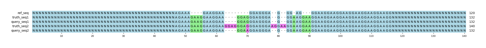

# Example `gh_issue_0025`
# Notes
This example is generated for [Aardvark issue 25](https://github.com/PacificBiosciences/aardvark/issues/25).
Reference created via `samtools faidx {reference} chr6:30378021-30378070`.
This region is a classic repeat region, where interpretation by variants is challenging.
Reviewing the region using a sequence-centric approach is generally more intuitive (see MSA).

## Reference sequences
```
>mock
NNNNNNNNNNNNNNNNNNNNNNNNNNNNNNNNNNNNNNNNNNNNNNNNNN
AGAAAGAAGGAAGGAGGGAGGGAGGGAAGGAAGGAAGGAAGGAAGGAAGG
NNNNNNNNNNNNNNNNNNNNNNNNNNNNNNNNNNNNNNNNNNNNNNNNNN
```
## Truth variants
```
#CHROM	POS	ID	REF	ALT	QUAL	FILTER	INFO	FORMAT	truth
mock	66	.	G	A	40	.	.	GT	1/1
mock	74	.	G	GGGAGGGAAGGAA,GGGAGGGAAGGAAGGAAGGAA	40	.	.	GT	2/1
```
## Query variants
```
#CHROM	POS	ID	REF	ALT	QUAL	FILTER	INFO	FORMAT	query
mock	55	.	A	AGAAG	40	.	.	GT	1/1
mock	66	.	G	A,C	40	.	.	GT	0/1
mock	74	.	G	A,GGGAAGGAA,GGGAGGGAAGGAA	40	.	.	GT	2/2
```
## Output summary
Variant Type | Metric | Hap.py-GT | Aardvark-GT | Aardvark-Basepair
:-- | :-- | --: | --: | --:
ALL | F1 | -- | 0.4444444444444444 | 0.8571428571428571
ALL | Recall | -- | 0.6666666666666666 (2/3) | 0.75 (48/64)
ALL | Precision | -- | 0.3333333333333333 (1/3) | 1.0 (48/48)
SNV | F1 |  | 1.0 | 0.5
SNV | Recall | 0.0 (0/1) | 1.0 (1/1) | 0.5 (2/4)
SNV | Precision | 0.0 (0/1) | 1.0 (1/1) | 0.5 (1/2)
INDEL | F1 |  | 0.0 | 0.8363636363636363
INDEL | Recall | 0.0 (0/1) | 0.5 (1/2) | 0.71875 (46/64)
INDEL | Precision | 0.0 (0/2) | 0.0 (0/2) | 1.0 (48/48)
## MSA visualization

