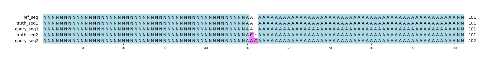

# Example `half_correct`
## Notes
This example highlights one of the interesting effects of using a basepair scoring scheme.
In the example, the truth set has a single SNP variant (A>C) while the query set instead detects that the "C" base was inserted.
It is clear that query is not fully correct in this situation, and both GT scoring scheme give this region a 0.0.
However, it _is_ detecting the "C" base where there were none before.
This situation is fairly common in homopolymer stretches where sequencing technologies may "slip" and mistake a SNP for an indel (or vice versa, see [half_correct_rev](../half_correct_rev)).

Interestingly, the basepair scoring scheme will give this partial credit.
It both detects that the "C" base has been correctly added, but also that the "A" base was _not_ removed.
This is the main situation where bases are assigned partially correct scores.
Thus, the recall and precision are both 0.5 in this example.

## Reference sequences
```
>mock
NNNNNNNNNNNNNNNNNNNNNNNNNNNNNNNNNNNNNNNNNNNNNNNNNN
AAAAAAAAAAAAAAAAAAAAAAAAAAAAAAAAAAAAAAAAAAAAAAAAAA
NNNNNNNNNNNNNNNNNNNNNNNNNNNNNNNNNNNNNNNNNNNNNNNNNN
```
## Truth variants
```
#CHROM	POS	ID	REF	ALT	QUAL	FILTER	INFO	FORMAT	truth
mock	52	.	A	C	40	.	.	GT	0/1
```
## Query variants
```
#CHROM	POS	ID	REF	ALT	QUAL	FILTER	INFO	FORMAT	query
mock	52	.	A	AC	40	.	.	GT	0/1
```
## Output summary
Variant Type | Metric | Hap.py-GT | Aardvark-GT | Aardvark-Basepair
:-- | :-- | --: | --: | --:
ALL | F1 | -- | NaN | 0.5
ALL | Recall | -- | 0.0 (0/1) | 0.5 (1/2)
ALL | Precision | -- | 0.0 (0/1) | 0.5 (1/2)
SNV | F1 |  |  | 
SNV | Recall | 0.0 (0/1) | 0.0 (0/1) | 0.5 (1/2)
SNV | Precision | 0.0 (0/0) |  (0/0) |  (0/0)
INDEL | F1 |  |  | 
INDEL | Recall | 0.0 (0/0) |  (0/0) |  (0/0)
INDEL | Precision | 0.0 (0/1) | 0.0 (0/1) | 0.5 (1/2)
## MSA visualization

