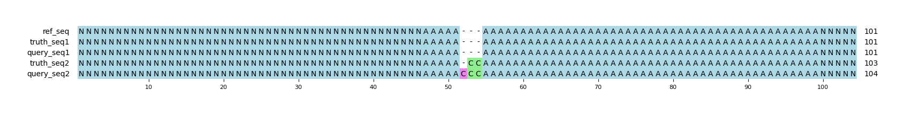

# Example `homopolymer_002`
## Reference sequences
```
>mock
NNNNNNNNNNNNNNNNNNNNNNNNNNNNNNNNNNNNNNNNNNNNNNNNNN
AAAAAAAAAAAAAAAAAAAAAAAAAAAAAAAAAAAAAAAAAAAAAAAAAA
NNNNNNNNNNNNNNNNNNNNNNNNNNNNNNNNNNNNNNNNNNNNNNNNNN
```
## Truth variants
```
#CHROM	POS	ID	REF	ALT	QUAL	FILTER	INFO	FORMAT	truth
mock	55	.	A	ACC	40	.	.	GT	0|1
```
## Query variants
```
#CHROM	POS	ID	REF	ALT	QUAL	FILTER	INFO	FORMAT	query
mock	55	.	A	ACCC	40	.	.	GT	0|1
```
## Output summary
Variant Type | Metric | Hap.py-GT | Aardvark-GT | Aardvark-Basepair
:-- | :-- | --: | --: | --:
ALL | F1 | -- | NaN | 0.8
ALL | Recall | -- | 0.0 (0/1) | 1.0 (4/4)
ALL | Precision | -- | 0.0 (0/1) | 0.6666666666666666 (4/6)
SNV | F1 | -- | -- | --
SNV | Recall | -- | -- | --
SNV | Precision | -- | -- | --
INDEL | F1 |  | NaN | 0.8
INDEL | Recall | 0.0 (0/1) | 0.0 (0/1) | 1.0 (4/4)
INDEL | Precision | 0.0 (0/1) | 0.0 (0/1) | 0.6666666666666666 (4/6)
## MSA visualization

