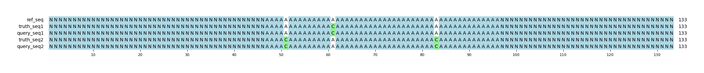

# Example `misphased_query_001`
## Notes
This example highlights the situation where the query has a phase error relative to the truth set.
Both Hap.py and Aardvark ignore the switch error, reporting F1=1.0 for the region.

## Reference sequences
```
>mock
NNNNNNNNNNNNNNNNNNNNNNNNNNNNNNNNNNNNNNNNNNNNNNNNNN
AAAAAAAAAAAAAAAAAAAAAAAAAAAAAAAAAAAAAAAAAAAAAAAAAA
NNNNNNNNNNNNNNNNNNNNNNNNNNNNNNNNNNNNNNNNNNNNNNNNNN
```
## Truth variants
```
#CHROM	POS	ID	REF	ALT	QUAL	FILTER	INFO	FORMAT	truth
mock	55	.	A	C	40	.	.	GT	0|1
mock	65	.	A	C	40	.	.	GT	1|0
mock	87	.	A	C	40	.	.	GT	0|1
```
## Query variants
```
#CHROM	POS	ID	REF	ALT	QUAL	FILTER	INFO	FORMAT	query
mock	55	.	A	C	40	.	.	GT	0|1
mock	65	.	A	C	40	.	.	GT	0|1
mock	87	.	A	C	40	.	.	GT	0|1
```
## Output summary
Variant Type | Metric | Hap.py-GT | Aardvark-GT | Aardvark-Basepair
:-- | :-- | --: | --: | --:
ALL | F1 | -- | 1.0 | 1.0
ALL | Recall | -- | 1.0 (3/3) | 1.0 (6/6)
ALL | Precision | -- | 1.0 (3/3) | 1.0 (6/6)
SNV | F1 | 1.0 | 1.0 | 1.0
SNV | Recall | 1.0 (3/3) | 1.0 (3/3) | 1.0 (6/6)
SNV | Precision | 1.0 (3/3) | 1.0 (3/3) | 1.0 (6/6)
INDEL | F1 | -- |  | 
INDEL | Recall | -- |  (0/0) |  (0/0)
INDEL | Precision | -- |  (0/0) |  (0/0)
## MSA visualization

