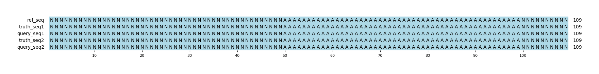

# Example `null_variants_001`
## Notes
This example demonstrates the impact of just two "null" variants in a query VCF.
The example has two 1-bp indels that effectively cancel each other out at the sequence level.
Aardvark correctly identifies there are no basepair differences in the sequences at all, and so the recall and precision are both 0/0.
This is likely the ideal outcome from this comparison, correctly recognizing no benefit while also not penalizing the query set.

If we instead look at the two genotype assessment mode, we see conflicting outcomes.
Aardvark-GT is designed to maximize the number of variants that are scored as positives, so the null variants are both counted as true positives.
Hap.py is also designed to maximize true positives, but it must be detecting these variants cancelling each other and reports them as false positives instead.
This detection process must be somewhat limited, see [null_variants_003](../null_variants_003/) for an example where it fails to identify the null variants.

## Reference sequences
```
>mock
NNNNNNNNNNNNNNNNNNNNNNNNNNNNNNNNNNNNNNNNNNNNNNNNNN
AAAAAAAAAAAAAAAAAAAAAAAAAAAAAAAAAAAAAAAAAAAAAAAAAA
NNNNNNNNNNNNNNNNNNNNNNNNNNNNNNNNNNNNNNNNNNNNNNNNNN
```
## Truth variants
```
#CHROM	POS	ID	REF	ALT	QUAL	FILTER	INFO	FORMAT	truth
mock	51	.	A	C	40	.	.	GT	0/0
```
## Query variants
```
#CHROM	POS	ID	REF	ALT	QUAL	FILTER	INFO	FORMAT	query
mock	52	.	AA	A	40	.	.	GT	0|1
mock	60	.	A	AA	40	.	.	GT	0|1
```
## Output summary
Variant Type | Metric | Hap.py-GT | Aardvark-GT | Aardvark-Basepair
:-- | :-- | --: | --: | --:
ALL | F1 | -- |  | 
ALL | Recall | -- |  (0/0) |  (0/0)
ALL | Precision | -- | 1.0 (2/2) |  (0/0)
SNV | F1 | -- | -- | --
SNV | Recall | -- | -- | --
SNV | Precision | -- | -- | --
INDEL | F1 |  |  | 
INDEL | Recall | 0.0 (0/0) |  (0/0) |  (0/0)
INDEL | Precision | 0.0 (0/2) | 1.0 (2/2) | 0.0 (0/4)
## MSA visualization

