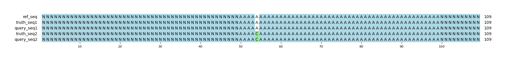

# Example `null_variants_003`
## Notes
This example is a variant of [null_variants_001](../null_variants_001) that includes an additional SNP in the truth set.
The query has injected two indels that are upstream and downstream of the SNP.
When the SNP position is shifted, these indels cancel each other out.

Both Hap.py and Aardvark treat these indels as true positives when scoring GT, showing 1 positive SNP and 2 positive indels.
At the variant level, Aardvark labels them as positives when scoring Basepair.
However, when the entire sequence is considered in `ALL` mode, only the SNP change is counted as a positive.
This effectively masking any scoring benefits from the indels that cancel each other out at the sequence level.

## Reference sequences
```
>mock
NNNNNNNNNNNNNNNNNNNNNNNNNNNNNNNNNNNNNNNNNNNNNNNNNN
AAAAAAAAAAAAAAAAAAAAAAAAAAAAAAAAAAAAAAAAAAAAAAAAAA
NNNNNNNNNNNNNNNNNNNNNNNNNNNNNNNNNNNNNNNNNNNNNNNNNN
```
## Truth variants
```
#CHROM	POS	ID	REF	ALT	QUAL	FILTER	INFO	FORMAT	truth
mock	55	.	A	C	40	.	.	GT	0|1
```
## Query variants
```
#CHROM	POS	ID	REF	ALT	QUAL	FILTER	INFO	FORMAT	query
mock	52	.	AA	A	40	.	.	GT	0|1
mock	56	.	A	C	40	.	.	GT	0|1
mock	60	.	A	AA	40	.	.	GT	0|1
```
## Output summary
Variant Type | Metric | Hap.py-GT | Aardvark-GT | Aardvark-Basepair
:-- | :-- | --: | --: | --:
ALL | F1 | -- | 1.0 | 1.0
ALL | Recall | -- | 1.0 (1/1) | 1.0 (2/2)
ALL | Precision | -- | 1.0 (3/3) | 1.0 (2/2)
SNV | F1 | 1.0 | 1.0 | 0.0
SNV | Recall | 1.0 (1/1) | 1.0 (1/1) | 1.0 (2/2)
SNV | Precision | 1.0 (1/1) | 1.0 (1/1) | 0.0 (0/2)
INDEL | F1 | 0.0 |  | 
INDEL | Recall | 0.0 (0/0) |  (0/0) |  (0/0)
INDEL | Precision | 1.0 (2/2) | 1.0 (2/2) | 0.25 (1/4)
## MSA visualization

