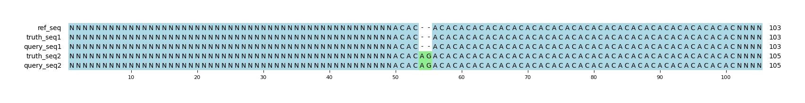

# Example `null_variants_004`
## Notes
Not all forms of null variants require a deletion cancelling an insertion.
This example shows an insertion of an AG in a dinucleotide AC repeat.
The truth has a simple representation, but the query has split this into an AC insertion followed by a C>G SNV.
In this instance, the query is showing variant churn through a sub-optimal representation of the AG insertion.
This type of variant churn is common in repeats like this, where alignment artifacts can generate problems with variant calling.

## Reference sequences
```
>mock
NNNNNNNNNNNNNNNNNNNNNNNNNNNNNNNNNNNNNNNNNNNNNNNNNN
ACACACACACACACACACACACACACACACACACACACACACACACACAC
NNNNNNNNNNNNNNNNNNNNNNNNNNNNNNNNNNNNNNNNNNNNNNNNNN
```
## Truth variants
```
#CHROM	POS	ID	REF	ALT	QUAL	FILTER	INFO	FORMAT	truth
mock	54	.	C	CAG	40	.	.	GT	0|1
```
## Query variants
```
#CHROM	POS	ID	REF	ALT	QUAL	FILTER	INFO	FORMAT	query
mock	52	.	C	CAC	40	.	.	GT	0|1
mock	54	.	C	G	40	.	.	GT	0|1
```
## Output summary
Variant Type | Metric | Hap.py-GT | Aardvark-GT | Aardvark-Basepair
:-- | :-- | --: | --: | --:
ALL | F1 | -- | 1.0 | 1.0
ALL | Recall | -- | 1.0 (1/1) | 1.0 (4/4)
ALL | Precision | -- | 1.0 (2/2) | 1.0 (4/4)
SNV | F1 | 0.0 |  | 
SNV | Recall | 0.0 (0/0) |  (0/0) |  (0/0)
SNV | Precision | 1.0 (1/1) | 1.0 (1/1) | 0.5 (1/2)
INDEL | F1 |  | 1.0 | 0.8571428571428571
INDEL | Recall | 1.0 (1/1) | 1.0 (1/1) | 1.0 (4/4)
INDEL | Precision |  (1/1) | 1.0 (1/1) | 0.75 (3/4)
## MSA visualization

