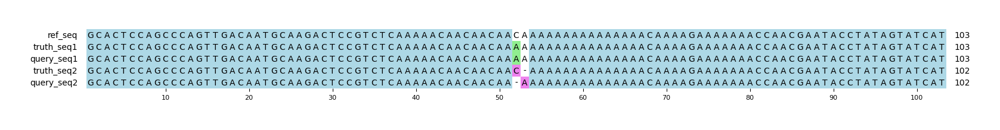

# Example `real_example_001`
## Notes
This captures a real example that is found in `chr1:6401103-6401205` in GIAB v4.2.1.
The query variants are pulled from a HiFi sequencing run for HG001.
In this example, the HiFi variant calling is partially correct.
It correctly identifies the SNP (which is represented as 52:CA>AA), but deletes the wrong base (51:AC>A instead of 52:CA>C).
Aardvark assigns partial credit to the allele that is observed, whereas Hap.py marks the entire call as incorrect.

## Reference sequences
```
>mock
GCACTCCAGCCCAGTTGACAATGCAAGACTCCGTCTCAAAAACAACAACA
ACAAAAAAAAAAAAAAACAAAAGAAAAAAACCAACGAATACCTATAGTAT
CAT
```
## Truth variants
```
#CHROM	POS	ID	REF	ALT	QUAL	FILTER	INFO	FORMAT	truth
mock	52	.	CA	AA,C	40	.	.	GT	2/1
```
## Query variants
```
#CHROM	POS	ID	REF	ALT	QUAL	FILTER	INFO	FORMAT	query
mock	51	.	AC	A	40	.	.	GT	0/1
mock	52	.	CA	AA,C	40	.	.	GT	0/1
```
## Output summary
Variant Type | Metric | Hap.py-GT | Aardvark-GT | Aardvark-Basepair
:-- | :-- | --: | --: | --:
ALL | F1 | -- | 0.5 | 0.75
ALL | Recall | -- | 0.5 (1/2) | 0.75 (3/4)
ALL | Precision | -- | 0.5 (1/2) | 0.75 (3/4)
SNV | F1 |  | 1.0 | 1.0
SNV | Recall | 0.0 (0/0) | 1.0 (1/1) | 1.0 (2/2)
SNV | Precision | 0.0 (0/1) | 1.0 (1/1) | 1.0 (2/2)
INDEL | F1 |  | NaN | 0.5
INDEL | Recall | 0.0 (0/1) | 0.0 (0/1) | 0.5 (1/2)
INDEL | Precision | 0.0 (0/1) | 0.0 (0/1) | 0.5 (1/2)
## MSA visualization

