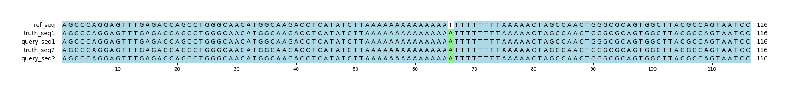

# Example `real_example_002`
## Notes
This captures a real example that is found in `chr1:35692923-35693038` in GIAB v4.2.1.
The query variants are pulled from a HiFi sequencing run for HG001.
In this example, the HiFi variant calling is partially correct, but it erroneously adds an insertion and deletion pair that combined create the same sequence as the single SNP.
This is an example where the variant calling software is creating variants that are fundamentally incompatible with each other.

Hap.py selects the homozygous SNP as a TP, and marks both indels as FP.
Aardvark finds identical sequences, but instead selects the two indels as TP and the SNP is marked as half-correct (i.e., one is a FP), which increases the GT precision to 2/3.
Lastly, Aardvark-Basepair identifies that the SNP variant is found, but that something (whether the SNP or indel) is injecting extra sequence into one of the query haplotypes, lowering the ALL precision to 0.66.

## Reference sequences
```
>mock
AGCCCAGGAGTTTGAGACCAGCCTGGGCAACATGGCAAGACCTCATATCT
TAAAAAAAAAAAAAATTTTTTTTTAAAAACTAGCCAACTGGGCGCAGTGG
CTTACGCCAGTAATCC
```
## Truth variants
```
#CHROM	POS	ID	REF	ALT	QUAL	FILTER	INFO	FORMAT	truth
mock	66	.	T	A	.	.	.	GT	1/1
```
## Query variants
```
#CHROM	POS	ID	REF	ALT	QUAL	FILTER	INFO	FORMAT	query
mock	51	.	T	TA	.	.	.	GT	0/1
mock	65	.	AT	A	.	.	.	GT	0/1
mock	66	.	T	A	.	.	.	GT	1/1
```
## Output summary
Variant Type | Metric | Hap.py-GT | Aardvark-GT | Aardvark-Basepair
:-- | :-- | --: | --: | --:
ALL | F1 | -- | 0.8 | 0.8
ALL | Recall | -- | 1.0 (1/1) | 1.0 (4/4)
ALL | Precision | -- | 0.6666666666666666 (2/3) | 0.6666666666666666 (4/6)
SNV | F1 | 1.0 | 0.0 | 1.0
SNV | Recall | 1.0 (1/1) | 1.0 (1/1) | 1.0 (4/4)
SNV | Precision | 1.0 (1/1) | 0.0 (0/1) | 1.0 (4/4)
INDEL | F1 |  |  | 
INDEL | Recall | 0.0 (0/0) |  (0/0) |  (0/0)
INDEL | Precision | 0.0 (0/2) | 1.0 (2/2) | 0.5 (2/4)
## MSA visualization

