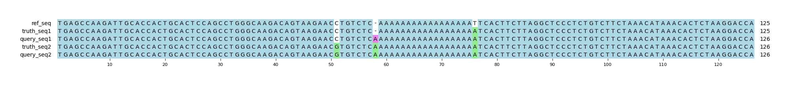

# Example `real_example_003`
## Notes
This captures a real example that is found in `chr1:66477475-66477599` in GIAB v4.2.1.
The query variants are pulled from a HiFi sequencing run for HG001.
In this example, the HiFi variant calling is almost sequence correct (there is a 1 bp difference), but the representation of the query variants is different from truth:

* The first variant is a relatively isolated variant shared by truth and query, it is a TP
* The second truth variant is also identified in the query, it is a TP
* The third truth variant is partially identified in the query (0/1 instead of 1/1), which on the surface looks like a FN. However, the combination of 57:C->CAA and 74:AT->A functionally generates the T->A SNP with an additional "A" inserted into the homopolymer. Thus the only difference (highlighted in magenta) between the truth and query haplotypes is an extra "A" base.

This is one of the better examples highlighting the benefits of the Aardvark-Basepair scoring scheme.
The score correctly identifies that all truth bases are present int the query, and that only one extra base is present, finding recall=1.0 and precision=0.8.
In this particular case, Aardvark-GT has the same metrics, indicating that Aardvark was able to isolate the FP base to a single variant entry.

However, the scores from Hap.py are much worse, with a combined recall=0.333 and precision=0.25 for the same set of variants despite only a single base difference in truth and query.
When we investigated the cause, it appears that Hap.py is splitting the variants into multiple super-loci instead of considering it as a single locus.
Increasing the Hap.py window size parameter did not correct the issue.

## Reference sequences
```
>mock
TGAGCCAAGATTGCACCACTGCACTCCAGCCTGGGCAAGACAGTAAGAAC
CTGTCTCAAAAAAAAAAAAAAAAATTCACTTCTTAGGCTCCCTCTGTCTT
CTAAACATAAACACTCTAAGGACCA
```
## Truth variants
```
#CHROM	POS	ID	REF	ALT	QUAL	FILTER	INFO	FORMAT	truth
mock	51	.	C	G	.	.	.	GT	0/1
mock	57	.	C	CA	.	.	.	GT	0/1
mock	75	.	T	A	.	.	.	GT	1/1
```
## Query variants
```
#CHROM	POS	ID	REF	ALT	QUAL	FILTER	INFO	FORMAT	query
mock	51	.	C	G	.	.	.	GT	0/1
mock	57	.	C	CA,CAA	.	.	.	GT	1/2
mock	74	.	AT	A	.	.	.	GT	0/1
mock	75	.	T	A	.	.	.	GT	0/1
```
## Output summary
Variant Type | Metric | Hap.py-GT | Aardvark-GT | Aardvark-Basepair
:-- | :-- | --: | --: | --:
ALL | F1 | -- | 0.888888888888889 | 0.888888888888889
ALL | Recall | -- | 1.0 (3/3) | 1.0 (8/8)
ALL | Precision | -- | 0.8 (4/5) | 0.8 (8/10)
SNV | F1 | 0.5 | 1.0 | 1.0
SNV | Recall | 0.5 (1/2) | 1.0 (2/2) | 1.0 (6/6)
SNV | Precision | 0.5 (1/2) | 1.0 (2/2) | 1.0 (4/4)
INDEL | F1 |  | 0.8 | 0.7692307692307693
INDEL | Recall | 0.0 (0/1) | 1.0 (1/1) | 1.0 (2/2)
INDEL | Precision | 0.0 (0/2) | 0.6666666666666666 (2/3) | 0.625 (5/8)
## MSA visualization

