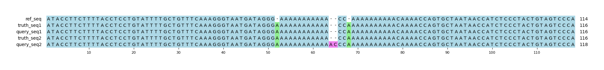

# Example `real_example_004`
## Notes
This captures a real example that is found in `chr1:67190382-67190495` in GIAB v4.2.1.
The query variants are pulled from a HiFi sequencing run for HG001.
In this example, the HiFi variant calling is almost sequence correct (there is a 2 bp difference), but the representation of the query variants is different from truth:

* Both truth variants are called in query, but with a different zygosity (0/1 instead of 1/1)
* The combination of 62:A->AAC and 64:C->A create the same pair of "A" insertions at the sequence level.
* 62:A->AAC is called homozygous instead of heterozygous, making it the source of the 2 bp FP.

This is one of the better examples highlighting the benefits of the Aardvark-Basepair scoring scheme.
The score correctly identifies that all truth bases are present int the query, and that only two extra bases are present, finding recall=1.0 and precision=0.666.
In this particular case, Aardvark-GT has the same metrics, indicating that Aardvark was able to isolate the FP base to a single variant entry.

However, the scores from Hap.py are much worse, with a combined recall=0.0 and precision=0.0 for the same set of variants despite only a two base difference in truth and query.
When we investigated the cause, it appears that Hap.py is splitting the variants into multiple super-loci instead of considering it as a single locus.
Increasing the Hap.py window size parameter did not correct the issue.

## Reference sequences
```
>mock
ATACCTTCTTTTACCTCCTGTATTTTGCTGTTTCAAAGGGTAATGATAGG
GAAAAAAAAAAACCAAAAAAAAAACAAAACCAGTGCTAATAACCATCTCC
CTACTGTAGTCCCA
```
## Truth variants
```
#CHROM	POS	ID	REF	ALT	QUAL	FILTER	INFO	FORMAT	truth
mock	51	.	G	GA	.	.	.	GT	1/1
mock	64	.	C	CA	.	.	.	GT	1/1
```
## Query variants
```
#CHROM	POS	ID	REF	ALT	QUAL	FILTER	INFO	FORMAT	query
mock	51	.	G	GA	.	.	.	GT	0/1
mock	62	.	A	AAC	.	.	.	GT	1/1
mock	64	.	C	A,CA	.	.	.	GT	1/2
```
## Output summary
Variant Type | Metric | Hap.py-GT | Aardvark-GT | Aardvark-Basepair
:-- | :-- | --: | --: | --:
ALL | F1 | -- | 0.8571428571428571 | 0.8
ALL | Recall | -- | 1.0 (2/2) | 1.0 (8/8)
ALL | Precision | -- | 0.75 (3/4) | 0.6666666666666666 (8/12)
SNV | F1 |  |  | 
SNV | Recall | 0.0 (0/0) |  (0/0) |  (0/0)
SNV | Precision | 0.0 (0/1) | 1.0 (1/1) | 0.5 (1/2)
INDEL | F1 |  | 0.8 | 0.7368421052631579
INDEL | Recall | 0.0 (0/2) | 1.0 (2/2) | 1.0 (8/8)
INDEL | Precision | 0.0 (0/3) | 0.6666666666666666 (2/3) | 0.5833333333333334 (7/12)
## MSA visualization

