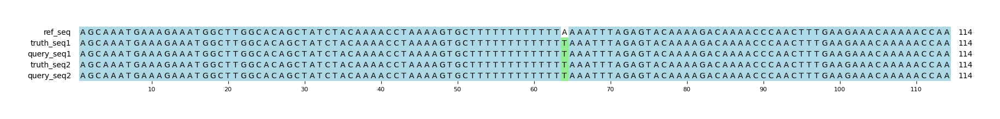

# Example `real_example_005`
## Notes
This captures a real example that is found in `chr1:71262162-71262275` in GIAB v4.2.1.
The query variants are pulled from a HiFi sequencing run for HG001.
In this example, the HiFi variant calling has produced two indel variants that collective are the same sequence as the SNP variant.

Aardvark-GT selects the two indels as TP and marks the SNP as a FP, whereas Hap.py marks the SNP as TP and the two indels as FP.
In constrast, the Aardvark-Basepair score recognizes that the variants represent a two basepair change (one per haplotype), and that the two indels should cancel each other out.
This results in a false positive basepair assignment.
## Reference sequences
```
>mock
AGCAAATGAAAGAAATGGCTTGGCACAGCTATCTACAAAACCTAAAAGTG
CTTTTTTTTTTTTAAAATTTAGAGTACAAAAGACAAAACCCAACTTTGAA
GAAACAAAAACCAA
```
## Truth variants
```
#CHROM	POS	ID	REF	ALT	QUAL	FILTER	INFO	FORMAT	truth
mock	64	.	A	T	.	.	.	GT	1/1
```
## Query variants
```
#CHROM	POS	ID	REF	ALT	QUAL	FILTER	INFO	FORMAT	query
mock	51	.	C	CT	.	.	.	GT	0/1
mock	63	.	TA	T	.	.	.	GT	0/1
mock	64	.	A	T	.	.	.	GT	1/1
```
## Output summary
Variant Type | Metric | Hap.py-GT | Aardvark-GT | Aardvark-Basepair
:-- | :-- | --: | --: | --:
ALL | F1 | -- | 0.8 | 0.8
ALL | Recall | -- | 1.0 (1/1) | 1.0 (4/4)
ALL | Precision | -- | 0.6666666666666666 (2/3) | 0.6666666666666666 (4/6)
SNV | F1 | 1.0 | 0.0 | 1.0
SNV | Recall | 1.0 (1/1) | 1.0 (1/1) | 1.0 (4/4)
SNV | Precision | 1.0 (1/1) | 0.0 (0/1) | 1.0 (4/4)
INDEL | F1 |  |  | 
INDEL | Recall | 0.0 (0/0) |  (0/0) |  (0/0)
INDEL | Precision | 0.0 (0/2) | 1.0 (2/2) | 0.5 (2/4)
## MSA visualization

