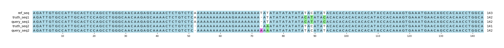

# Example `real_example_006`
## Notes
This captures a real example that is found in `chr1:1743494-1743636` in T2TQ100-V1.1.
The query variants are pulled from a HiFi sequencing run for HG002.

This particle example includes many confounding factors that make it difficult to match the variants up correctly.
First, the truth set contains multi-allelic variants and haploid genotypes, the latter of which does not seem to be supported by Hap.py.
Additionally, the truth set representations tend to squish multiple changes together into a single variant, while the query set representation is more discretized.
All of these complication result in Hap.py only identifying one TP call in the entire collection.
In constrast, Aardvark's sequence-centric view allows it to find most of the variants in both the truth and query sets despite the confounding factors, leading to much higher precision and recall.

## Reference sequences
```
>mock
AGATTGTGCCATTGCACTCCAGCCTGGGCAACAAGAGCAAAACTCTGTCT
CAAAAAAAAAAAAGAAAAAAAATATATATATATATATACATATACACACA
CACACACATACCACAAAGTGAAATGAACAGCCACAACCTGGCA
```
## Truth variants
```
#CHROM	POS	ID	REF	ALT	QUAL	FILTER	INFO	FORMAT	truth
mock	51	.	CA	C	.	.	.	GT	0|1
mock	72	.	ATAT	A,AAT	.	.	.	GT	1|2
mock	75	.	T	A,*	.	.	.	GT	2|1
mock	93	.	T	TAC	.	.	.	GT	1|0
```
## Query variants
```
#CHROM	POS	ID	REF	ALT	QUAL	FILTER	INFO	FORMAT	query
mock	51	.	CA	C	.	.	.	GT	0|1
mock	72	.	AT	A	.	.	.	GT	0/1
mock	73	.	T	A	.	.	.	GT	0/1
mock	75	.	T	A	.	.	.	GT	0|1
mock	87	.	T	C	.	.	.	GT	1|0
mock	89	.	C	T	.	.	.	GT	1|0
mock	93	.	T	C	.	.	.	GT	1|0
```
## Output summary
Variant Type | Metric | Hap.py-GT | Aardvark-GT | Aardvark-Basepair
:-- | :-- | --: | --: | --:
ALL | F1 | -- | 0.8275862068965518 | 0.9285714285714286
ALL | Recall | -- | 0.8 (4/5) | 0.9285714285714286 (13/14)
ALL | Precision | -- | 0.8571428571428571 (6/7) | 0.9285714285714286 (13/14)
SNV | F1 |  | 0.888888888888889 | 0.9473684210526316
SNV | Recall | 0.0 (0/0) | 1.0 (1/1) | 1.0 (2/2)
SNV | Precision | 0.0 (0/5) | 0.8 (4/5) | 0.9 (9/10)
INDEL | F1 | 0.4 | 0.8571428571428571 | 0.88
INDEL | Recall | 0.333333 (1/3) | 0.75 (3/4) | 0.7857142857142857 (11/14)
INDEL | Precision | 0.5 (1/2) | 1.0 (2/2) | 1.0 (4/4)
## MSA visualization

