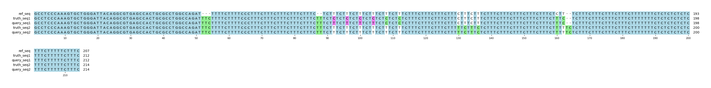

# Example `real_example_007`
## Notes
### Auto-generated metadata
* Sample type: HG002
* Benchmark: T2TQ100-V1.1
* Sample: HG002_revio
* Coordinates: chr1:2872842-2873048

### Manual notes
This example was identified as an area where Hap.py had several FN/FP in the outputs.
However, after isolating the sub-region in this example, those errors did not replicate.
The errors from the original run are replicated below, and appear to be related to the "*" alleles, which are seemingly absent in this main run:
```
chr1	2872922	.	TTC	T	.	.	BS=2872923;Regions=CONF,TS_contained	GT:BD:BK:BI:BVT:BLT:QQ	0|1:FN:am:d1_5:INDEL:het:.	.:.:.:.:NOCALL:nocall:0
chr1	2872924	.	C	CTT	.	.	BS=2872923;Regions=CONF,TS_contained	GT:BD:BK:QQ:BI:BVT:BLT	1|.:FN:.:.:i1_5:INDEL:halfcall	1/1:FP:am:25:i1_5:INDEL:homalt
chr1	2872928	.	T	C	.	.	BS=2872923;Regions=CONF,TS_contained	GT:BD:BK:BI:BVT:BLT:QQ	1|0:FN:.:ti:SNP:het:.	.:.:.:.:NOCALL:nocall:25
chr1	2872932	.	T	C	.	.	BS=2872923;Regions=CONF,TS_contained	GT:BD:BK:BI:BVT:BLT:QQ	1|0:FN:.:ti:SNP:het:.	.:.:.:.:NOCALL:nocall:25
chr1	2872936	.	T	C	.	.	BS=2872923;Regions=CONF,TS_contained	GT:BD:BK:BI:BVT:BLT:QQ	1|0:FN:.:ti:SNP:het:.	.:.:.:.:NOCALL:nocall:25
chr1	2872940	.	T	C	.	.	BS=2872923;Regions=CONF,TS_contained	GT:BD:BK:BI:BVT:BLT:QQ	1|0:FN:.:ti:SNP:het:.	.:.:.:.:NOCALL:nocall:25
chr1	2872966	.	C	T	.	.	BS=2872923;Regions=CONF,TS_contained	GT:QQ:BD:BK:BI:BVT:BLT	.:.:.:.:.:NOCALL:nocall	0/1:18.9:FP:am:ti:SNP:het
chr1	2872968	.	T	C,TTTTCTTTC	.	.	BS=2872923;Regions=CONF,TS_contained	GT:BD:BK:QQ:BI:BVT:BLT	0|2:FN:am:.:i6_15:INDEL:het	0/1:FP:am:15.7:ti:SNP:het
chr1	2872970	.	C	T	.	.	BS=2872923;Regions=CONF,TS_contained	GT:QQ:BD:BK:BI:BVT:BLT	.:.:.:.:.:NOCALL:nocall	0/1:18.2:FP:am:ti:SNP:het
chr1	2872972	.	T	C	.	.	BS=2872923;Regions=CONF,TS_contained	GT:QQ:BD:BK:BI:BVT:BLT	.:.:.:.:.:NOCALL:nocall	0/1:14.8:FP:am:ti:SNP:het
chr1	2872994	.	C	T	.	.	BS=2872923;Regions=CONF,TS_contained	GT:BD:BK:BI:BVT:BLT:QQ	0|1:FN:am:ti:SNP:het:.	.:.:.:.:NOCALL:nocall:14.8
chr1	2872996	.	C	T	.	.	BS=2872923;Regions=CONF,TS_contained	GT:QQ:BD:BK:BI:BVT:BLT	.:.:.:.:.:NOCALL:nocall	1/1:37:FP:am:ti:SNP:homalt
chr1	2872996	.	CTT	C,TTT	.	.	BS=2872923;Regions=CONF,TS_contained	GT:BD:BK:BI:BVT:BLT:QQ	2|1:FN:am:d1_5,ti:INDEL:hetalt:.	.:.:.:.:NOCALL:nocall:37
chr1	2872998	.	T	C	.	.	BS=2872923;Regions=CONF,TS_contained	GT:BD:BK:QQ:BI:BVT:BLT	1|.:FN:.:.:ti:SNP:halfcall	0/1:FP:.:28.8:ti:SNP:het
chr1	2872998	.	T	TTC	.	.	BS=2872923;Regions=CONF,TS_contained	GT:QQ:BD:BK:BI:BVT:BLT	.:.:.:.:.:NOCALL:nocall	0/1:28.8:FP:am:i1_5:INDEL:het
```

## Reference sequences
```
>mock
GCCTCCCAAAGTGCTGGGATTACAGGCGTGAGCCACTGCGCCTGGCCAGA
TTTTTCTTTTCCCTTTCTTTCTTTCTTTCTTTCTCTTTCTTTCTTTCTTT
CTTTCTTTCTTTCTTTCTTTCTTTCTTTCTTTCTTTCTTTCTTTCTTTCT
TTCTCTTTCTTTCTTTCTTTCTTTCTTTTTTTCTCTCTCTCTCTTTCTTT
TTCTTTC
```
## Truth variants
```
#CHROM	POS	ID	REF	ALT	QUAL	FILTER	INFO	FORMAT	truth
mock	51	.	T	TTTC	.	.	.	GT	1|1
mock	81	.	TTC	T	.	.	.	GT	0|1
mock	83	.	C	CTT,*	.	.	.	GT	1|2
mock	87	.	T	C	.	.	.	GT	1|0
mock	91	.	T	C	.	.	.	GT	1|0
mock	95	.	T	C	.	.	.	GT	1|0
mock	99	.	T	C	.	.	.	GT	1|0
mock	103	.	T	C	.	.	.	GT	1|0
mock	107	.	T	C	.	.	.	GT	1|0
mock	127	.	T	TTTTCTTTC	.	.	.	GT	0|1
mock	153	.	C	T	.	.	.	GT	0|1
mock	155	.	CTT	C,TTT	.	.	.	GT	2|1
mock	157	.	T	C,*	.	.	.	GT	1|2
```
## Query variants
```
#CHROM	POS	ID	REF	ALT	QUAL	FILTER	INFO	FORMAT	query
mock	51	.	T	TTTC	.	.	.	GT	1/1
mock	83	.	C	CTT	.	.	.	GT	1/1
mock	103	.	T	C	.	.	.	GT	1|0
mock	107	.	T	C	.	.	.	GT	1|0
mock	125	.	C	T	.	.	.	GT	0|1
mock	127	.	T	C	.	.	.	GT	0|1
mock	129	.	C	T	.	.	.	GT	0|1
mock	131	.	T	C	.	.	.	GT	0|1
mock	155	.	C	T	.	.	.	GT	1/1
mock	157	.	T	C,TTC	.	.	.	GT	1|2
```
## Output summary
Variant Type | Metric | Hap.py-GT | Aardvark-GT | Aardvark-Basepair
:-- | :-- | --: | --: | --:
ALL | F1 | -- | 0.8333333333333333 | 0.9130434782608696
ALL | Recall | -- | 0.7142857142857143 (10/14) | 0.84 (42/50)
ALL | Precision | -- | 1.0 (11/11) | 1.0 (42/42)
SNV | F1 | 0.666667 | 0.7142857142857143 | 0.7142857142857143
SNV | Recall | 0.5 (4/8) | 0.5555555555555556 (5/9) | 0.5555555555555556 (10/18)
SNV | Precision | 1.0 (8/8) | 1.0 (8/8) | 1.0 (18/18)
INDEL | F1 | 1.0 | 1.0 | 0.9041095890410958
INDEL | Recall | 1.0 (5/5) | 1.0 (5/5) | 0.825 (33/40)
INDEL | Precision | 1.0 (3/3) | 1.0 (3/3) | 1.0 (24/24)
## MSA visualization

