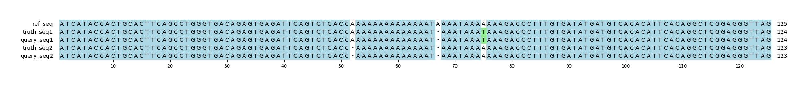

# Example `real_example_008`
## Notes
### Auto-generated metadata
* Sample type: HG002
* Benchmark: T2TQ100-V1.1
* Sample: HG002_revio
* Coordinates: chr1:6742048-6742172

### Manual notes
This an example where Hap.py annotates several of the variants as "halfcall", and then marks them as errors.
This has a cascading effect, such that only one truth variant is identified as a TP by Hap.py.
In constrast, Aardvark matches up each variant for an F1=1.0 for both GT and BASEPAIR.

## Reference sequences
```
>mock
ATCATACCACTGCACTTCAGCCTGGGTGACAGAGTGAGATTCAGTCTCAC
CAAAAAAAAAAAAAATAAAATAAAAAAAGACCCTTTGTGATATGATGTCA
CACATTCACAGGCTCGGAGGGTTAG
```
## Truth variants
```
#CHROM	POS	ID	REF	ALT	QUAL	FILTER	INFO	FORMAT	truth
mock	64	.	AAT	A	.	.	.	GT	0|1
mock	66	.	TA	T,*	.	.	.	GT	1|2
mock	67	.	A	T,*	.	.	.	GT	2|1
mock	75	.	A	T	.	.	.	GT	1|0
```
## Query variants
```
#CHROM	POS	ID	REF	ALT	QUAL	FILTER	INFO	FORMAT	query
mock	51	.	CA	C	.	.	.	GT	0|1
mock	66	.	TA	T	.	.	.	GT	1/1
mock	75	.	A	T	.	.	.	GT	1|0
```
## Output summary
Variant Type | Metric | Hap.py-GT | Aardvark-GT | Aardvark-Basepair
:-- | :-- | --: | --: | --:
ALL | F1 | -- | 1.0 | 1.0
ALL | Recall | -- | 1.0 (4/4) | 1.0 (8/8)
ALL | Precision | -- | 1.0 (3/3) | 1.0 (8/8)
SNV | F1 | 1.0 | 1.0 | 0.8571428571428571
SNV | Recall | 1.0 (1/1) | 1.0 (2/2) | 0.75 (3/4)
SNV | Precision | 1.0 (1/1) | 1.0 (1/1) | 1.0 (2/2)
INDEL | F1 |  | 1.0 | 0.9090909090909091
INDEL | Recall | 0.0 (0/2) | 1.0 (2/2) | 0.8333333333333334 (5/6)
INDEL | Precision | 0.0 (0/2) | 1.0 (2/2) | 1.0 (6/6)
## MSA visualization

