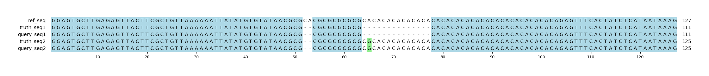

# Example `real_example_009`
## Notes
### Auto-generated metadata
* Sample type: HG002
* Benchmark: T2TQ100-V1.1
* Sample: HG002_revio
* Coordinates: chr1:6899492-6899618

### Manual notes
This is another example where the T2T benchmark annotations appear to be mis-interpreted by Hap.py.
This results in one SNV getting missed entirely, and the other getting marked as a FP.
Aardvark matches the query variants up to the truth variants for an F1=1.0.

## Reference sequences
```
>mock
GGAGTGCTTGAGAGTTACTTCGCTGTTAAAAAATTATATGTGTATAACGC
GCACGCGCGCGCGCACACACACACACACACACACACACACACACACACAC
ACAGAGTTTCACTATCTCATAATAAAG
```
## Truth variants
```
#CHROM	POS	ID	REF	ALT	QUAL	FILTER	INFO	FORMAT	truth
mock	51	.	GCA	G	.	.	.	GT	0|1
mock	53	.	A	G,*	.	.	.	GT	1|2
mock	61	.	GCGCACACACACACACA	G	.	.	.	GT	1|0
mock	65	.	A	G,*	.	.	.	GT	2|1
```
## Query variants
```
#CHROM	POS	ID	REF	ALT	QUAL	FILTER	INFO	FORMAT	query
mock	51	.	GCA	G	.	.	.	GT	1/1
mock	63	.	GCACACACACACACA	G	.	.	.	GT	1|0
mock	65	.	A	G	.	.	.	GT	0|1
```
## Output summary
Variant Type | Metric | Hap.py-GT | Aardvark-GT | Aardvark-Basepair
:-- | :-- | --: | --: | --:
ALL | F1 | -- | 1.0 | 1.0
ALL | Recall | -- | 1.0 (4/4) | 1.0 (38/38)
ALL | Precision | -- | 1.0 (3/3) | 1.0 (38/38)
SNV | F1 | 0.0 | 1.0 | 0.8571428571428571
SNV | Recall | 1.0 (1/1) | 1.0 (2/2) | 0.75 (3/4)
SNV | Precision | 0.0 (0/1) | 1.0 (1/1) | 1.0 (2/2)
INDEL | F1 | 1.0 | 1.0 | 0.9859154929577464
INDEL | Recall | 1.0 (2/2) | 1.0 (2/2) | 0.9722222222222222 (35/36)
INDEL | Precision | 1.0 (2/2) | 1.0 (2/2) | 1.0 (36/36)
## MSA visualization

