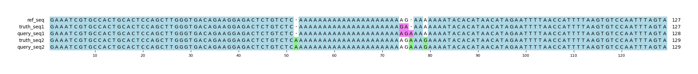

# Example `real_example_010`
## Notes
### Auto-generated metadata
* Sample type: HG002
* Benchmark: T2TQ100-V1.1
* Sample: HG002_revio
* Coordinates: chr1:6943796-6943922

### Manual notes
This is a complicated example where we suspect that the Hap.py is incorrect, though the source of the error is unclear.
If we review the variants, we see that the first and last truth variant are phased together and very clearly match the first and last variant of query (though they are not marked as phased).
Interestly, Hap.py flags the first of the query variants as a FP in the output.
The second and third variants from truth are phased onto the other truth haplotype, and are length neutral (two SNVs, no indels).
However, the only remaining variant in query is a single-base insertion, which cannot exactly match two SNVs.
This result is unexpected based on our understanding of the Hap.py algorithms, but we do not have an explanation for why it's happening here.

Aardvark appears to pair the query and truth variants up correctly to minimize the edit distance.
The first and last variants of each set are paired onto the second haplotype for exact matching sequences, and the two truth SNVs and remaining query insertion are paired onto the first haplotype (see MSA below).
We note that while the first haplotype is not an exact match, the calculated edit distance is only 1 (the MSA alignment below can shift such that there is only an extra "A" base in query_seq1 relative to truth_seq1).
It's possible that this minor difference is somehow creating the unexpected behavior from Hap.py.
Regardless, Aardvark's behavior in this example is following expectations, generating BASEPAIR metrics with only 1 bp recall error, and GT metrics that match the explanation above.

## Reference sequences
```
>mock
GAAATCGTGCCACTGCACTCCAGCTTGGGTGACAGAAGGAGACTCTGTCT
CAAAAAAAAAAAAAAAAAAAAAAGAAAAAAATACACATAACATAGAATTT
TAACCATTTTAAGTGTCCAATTTAGTA
```
## Truth variants
```
#CHROM	POS	ID	REF	ALT	QUAL	FILTER	INFO	FORMAT	truth
mock	51	.	C	CA	.	.	.	GT	0|1
mock	73	.	A	G	.	.	.	GT	1|0
mock	74	.	G	A	.	.	.	GT	1|0
mock	77	.	A	AG	.	.	.	GT	0|1
```
## Query variants
```
#CHROM	POS	ID	REF	ALT	QUAL	FILTER	INFO	FORMAT	query
mock	51	.	C	CA	.	.	.	GT	0/1
mock	74	.	G	A,GA	.	.	.	GT	2|0
mock	77	.	A	AG	.	.	.	GT	0|1
```
## Output summary
Variant Type | Metric | Hap.py-GT | Aardvark-GT | Aardvark-Basepair
:-- | :-- | --: | --: | --:
ALL | F1 | -- | 0.5714285714285715 | 0.8571428571428571
ALL | Recall | -- | 0.5 (2/4) | 0.75 (6/8)
ALL | Precision | -- | 0.6666666666666666 (2/3) | 1.0 (6/6)
SNV | F1 | 0.0 |  | 
SNV | Recall | 1.0 (2/2) | 0.0 (0/2) | 0.5 (2/4)
SNV | Precision | 0.0 (0/0) |  (0/0) |  (0/0)
INDEL | F1 | 0.8 | 0.8 | 1.0
INDEL | Recall | 1.0 (2/2) | 1.0 (2/2) | 1.0 (4/4)
INDEL | Precision | 0.666667 (2/3) | 0.6666666666666666 (2/3) | 1.0 (6/6)
## MSA visualization

