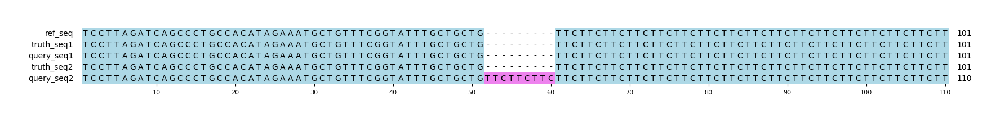

# Example `real_example_011`
## Notes
### Auto-generated metadata
* Sample type: HG002
* Benchmark: T2TQ100-V1.1
* Sample: HG002_revio
* Coordinates: chr1:7284066-7284246

### Manual notes
This example shows a region where Hap.py has grouped relatively distant variants into a single region, whereas Aardvark has them split into two with default parameters.
Of course, this leads to different results since the two tools are considering different sets of variants.
Increasing the window parameter of Aardvark (`--min-variant-gap 60`) will merge the two regions into one, changing the overall GT metrics to recall=1.0, precision=0.5, and f1=0.6666.

## Reference sequences
```
>mock
ACAGCCACTGTCCTTAGATCAGCCCTGCCACATAGAAATGCTGTTTCGGT
ATTTGCTGCTGTTCTTCTTCTTCTTCTTCTTCTTCTTCTTCTTCTTCTTC
TTCTTCTTCTTCTTATTATTATTATTATTATTATTATTATTATTATTATT
ATTTCTGAGAAGGAGTCTTGCTCTGTCACCC
```
## Truth variants
```
#CHROM	POS	ID	REF	ALT	QUAL	FILTER	INFO	FORMAT	truth
mock	115	.	A	C	.	.	.	GT	0|1
mock	118	.	A	C	.	.	.	GT	0|1
mock	121	.	A	C	.	.	.	GT	0|1
```
## Query variants
```
#CHROM	POS	ID	REF	ALT	QUAL	FILTER	INFO	FORMAT	query
mock	61	.	G	GTTCTTCTTC	.	.	.	GT	0|1
mock	112	.	CTTATTATTA	C	.	.	.	GT	0|1
mock	118	.	A	C	.	.	.	GT	0|1
mock	121	.	A	C	.	.	.	GT	0|1
```
## Output summary
Variant Type | Metric | Hap.py-GT | Aardvark-GT | Aardvark-Basepair
:-- | :-- | --: | --: | --:
ALL | F1 | -- | 0.5714285714285715 | 0.1739130434782609
ALL | Recall | -- | 0.6666666666666666 (2/3) | 0.6666666666666666 (4/6)
ALL | Precision | -- | 0.5 (2/4) | 0.1 (4/40)
SNV | F1 | 0.0 | 0.8 | 0.8
SNV | Recall | 1.0 (3/3) | 0.6666666666666666 (2/3) | 0.6666666666666666 (4/6)
SNV | Precision | 0.0 (0/2) | 1.0 (2/2) | 1.0 (4/4)
INDEL | F1 | 0.0 |  | 
INDEL | Recall | 0.0 (0/0) |  (0/0) |  (0/0)
INDEL | Precision | 1.0 (2/2) | 0.0 (0/2) | 0.0 (0/36)
## MSA visualization

