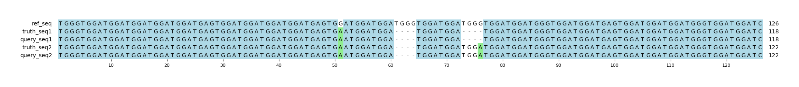

# Example `real_example_012`
## Notes
### Auto-generated metadata
* Sample type: HG002
* Benchmark: T2TQ100-V1.1
* Sample: HG002_revio
* Coordinates: chr1:9357086-9357211

### Manual notes
Despite their proximity, Hap.py appears to be splitting these variants into two groups and solving those separately, leading to several false positives/negatives.
In contrast, Aardvark keeps these as a single group and identifies that the variants are equivalent.

## Reference sequences
```
>mock
TGGGTGGATGGATGGATGGATGGATGAGTGGATGGATGGATGGATGAGTG
GATGGATGGATGGGTGGATGGATGGGTGGATGGATGGGTGGATGGATGAG
TGGATGGATGGATGGGTGGATGGATC
```
## Truth variants
```
#CHROM	POS	ID	REF	ALT	QUAL	FILTER	INFO	FORMAT	truth
mock	51	.	G	A	.	.	.	GT	1|1
mock	56	.	ATGGATGGG	A	.	.	.	GT	1|0
mock	60	.	ATGGG	A,*	.	.	.	GT	2|1
mock	76	.	G	A	.	.	.	GT	1|1
```
## Query variants
```
#CHROM	POS	ID	REF	ALT	QUAL	FILTER	INFO	FORMAT	query
mock	51	.	G	A	.	.	.	GT	1/1
mock	60	.	ATGGG	A	.	.	.	GT	1/1
mock	72	.	ATGGG	A	.	.	.	GT	0|1
mock	76	.	G	A	.	.	.	GT	1|0
```
## Output summary
Variant Type | Metric | Hap.py-GT | Aardvark-GT | Aardvark-Basepair
:-- | :-- | --: | --: | --:
ALL | F1 | -- | 1.0 | 1.0
ALL | Recall | -- | 1.0 (4/4) | 1.0 (30/30)
ALL | Precision | -- | 1.0 (4/4) | 1.0 (30/30)
SNV | F1 | 0.5 | 1.0 | 0.9333333333333333
SNV | Recall | 0.5 (1/2) | 1.0 (2/2) | 0.875 (7/8)
SNV | Precision | 0.5 (1/2) | 1.0 (2/2) | 1.0 (6/6)
INDEL | F1 |  | 1.0 | 0.9787234042553191
INDEL | Recall | 0.0 (0/1) | 1.0 (2/2) | 0.9583333333333334 (23/24)
INDEL | Precision | 0.0 (0/2) | 1.0 (2/2) | 1.0 (24/24)
## MSA visualization

