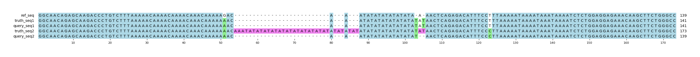

# Example `real_example_013`
## Notes
### Auto-generated metadata
* Sample type: HG002
* Benchmark: T2TQ100-V1.1
* Sample: HG002_revio
* Coordinates: chr1:11882674-11882812

### Manual notes
In this example, the large insertion in the truth set is clearly absent from query.
However, all other query variants can be oriented to match the other variants in truth, which Aardvark identifies.

## Reference sequences
```
>mock
GGCAACAGAGCAAGACCCTGTCTTTAAAAACAAAACAAAACAAACAAAAA
GACAAATATATATATATATAAAACTCAGAGACATTTCCTTTAAAAATAAA
ATAAATAAAATCTCTGGAGGAGAAACAAGCTTCTGGGCC
```
## Truth variants
```
#CHROM	POS	ID	REF	ALT	QUAL	FILTER	INFO	FORMAT	truth
mock	51	.	G	A	.	.	.	GT	1|1
mock	55	.	A	AAT,AATATATATATATATATATATATATATATATATAT	.	.	.	GT	1|2
mock	71	.	A	T	.	.	.	GT	1|1
mock	89	.	T	C	.	.	.	GT	0|1
```
## Query variants
```
#CHROM	POS	ID	REF	ALT	QUAL	FILTER	INFO	FORMAT	query
mock	51	.	G	A	.	.	.	GT	1/1
mock	70	.	A	AT	.	.	.	GT	0|1
mock	71	.	A	AT,T	.	.	.	GT	2|1
mock	89	.	T	C	.	.	.	GT	1|0
```
## Output summary
Variant Type | Metric | Hap.py-GT | Aardvark-GT | Aardvark-Basepair
:-- | :-- | --: | --: | --:
ALL | F1 | -- | 0.888888888888889 | 0.2444444444444444
ALL | Recall | -- | 0.8 (4/5) | 0.14102564102564102 (11/78)
ALL | Precision | -- | 1.0 (5/5) | 0.9166666666666666 (11/12)
SNV | F1 | 0.666667 | 1.0 | 0.8873239436619719
SNV | Recall | 0.666667 (2/3) | 1.0 (3/3) | 0.9 (9/10)
SNV | Precision | 0.666667 (2/3) | 1.0 (3/3) | 0.875 (7/8)
INDEL | F1 |  | 0.6666666666666666 | 0.10526315789473684
INDEL | Recall | 0.0 (0/1) | 0.5 (1/2) | 0.05555555555555555 (4/72)
INDEL | Precision | 0.0 (0/2) | 1.0 (2/2) | 1.0 (4/4)
## MSA visualization

