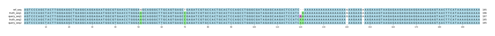

# Example `real_example_014`
## Notes
### Auto-generated metadata
* Sample type: HG002
* Benchmark: T2TQ100-V1.1
* Sample: HG002_revio
* Coordinates: chr1:16195011-16195205

### Manual notes
Another complex example where Aardvark is able to reduce the sequence differences to a single extra basepair in query.
For GT scoring, this translate into a single FN and FP.

## Reference sequences
```
>mock
AGTCCCAGCTACTTGGGAGGCTGAGGCAGGAGAATGGCGTGAACCTGGGA
GGCAGGGCTTGCAGTGAGCTGAGATCGTGCCACTGCACTCCAGCCTGGGC
GATAGAGCAAGACTCCATCAAAAAAAAAAAAAAAAAAGAAGAAGAAAGAA
AGTAAGAGAAGAGAGAGGAAAAAGAGTAACTTCATAAAAGAAAAA
```
## Truth variants
```
#CHROM	POS	ID	REF	ALT	QUAL	FILTER	INFO	FORMAT	truth
mock	51	.	G	A	.	.	.	GT	1|1
mock	70	.	T	C	.	.	.	GT	1|1
mock	119	.	C	CA	.	.	.	GT	1|0
mock	138	.	G	A	.	.	.	GT	0|1
mock	141	.	G	A	.	.	.	GT	0|1
mock	142	.	A	G	.	.	.	GT	0|1
mock	144	.	G	A	.	.	.	GT	0|1
mock	145	.	A	G	.	.	.	GT	0|1
```
## Query variants
```
#CHROM	POS	ID	REF	ALT	QUAL	FILTER	INFO	FORMAT	query
mock	51	.	G	A	.	.	.	GT	1/1
mock	70	.	T	C	.	.	.	GT	1/1
mock	119	.	C	CA,CAA	.	.	.	GT	1|2
mock	138	.	G	A	.	.	.	GT	0|1
mock	144	.	GA	G	.	.	.	GT	0|1
```
## Output summary
Variant Type | Metric | Hap.py-GT | Aardvark-GT | Aardvark-Basepair
:-- | :-- | --: | --: | --:
ALL | F1 | -- | 0.8536585365853658 | 0.9411764705882353
ALL | Recall | -- | 0.875 (7/8) | 1.0 (16/16)
ALL | Precision | -- | 0.8333333333333334 (5/6) | 0.8888888888888888 (16/18)
SNV | F1 | 0.6 | 1.0 | 1.0
SNV | Recall | 0.428571 (3/7) | 1.0 (7/7) | 1.0 (14/14)
SNV | Precision | 1.0 (3/3) | 1.0 (3/3) | 1.0 (10/10)
INDEL | F1 |  | 0.0 | 0.8571428571428571
INDEL | Recall | 0.0 (0/1) | 0.0 (0/1) | 1.0 (2/2)
INDEL | Precision | 0.0 (0/2) | 0.6666666666666666 (2/3) | 0.75 (6/8)
## MSA visualization

