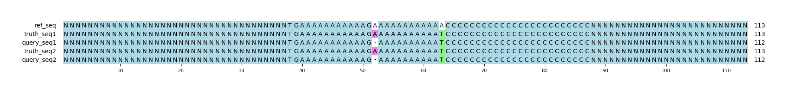

# Example `repr_bias_001a`
## Notes
This example was generated in conjunction with [repr_bias_001b](../repr_bias_001b) to demonstrate how variant representation can bias GT scoring.
In this example, the query variants are represented as individual small variants (SNP/indel).
When scored, both Hap.py and aardvark-GT detect the SNP as a TP and the indel as a FP.

This example was generated manually using a real event in a tandem repeat within the human genome: `chr1:61,593,380-61,593,419`.

## Reference sequences
```
>mock
NNNNNNNNNNNNNNNNNNNNNNNNNNNNNNNNNNNNNNNNNNNNNNNNNN
TGAAAAAAAAAAAGAAAAAAAAAAAACCCCCCCCCCCCCCCCCCCCCCCC
NNNNNNNNNNNNNNNNNNNNNNNNNNNNNNNNNNNNNNNNNNNNNNNNNN
```
## Truth variants
```
#CHROM	POS	ID	REF	ALT	QUAL	FILTER	INFO	FORMAT	truth
mock	76	.	A	T	40	.	.	GT	1/1
```
## Query variants
```
#CHROM	POS	ID	REF	ALT	QUAL	FILTER	INFO	FORMAT	query
mock	64	.	GA	G	40	.	.	GT	1/1
mock	76	.	A	T	40	.	.	GT	1/1
```
## Output summary
Variant Type | Metric | Hap.py-GT | Aardvark-GT | Aardvark-Basepair
:-- | :-- | --: | --: | --:
ALL | F1 | -- | 0.6666666666666666 | 0.6666666666666666
ALL | Recall | -- | 1.0 (1/1) | 1.0 (4/4)
ALL | Precision | -- | 0.5 (1/2) | 0.5 (4/8)
SNV | F1 | 1.0 | 1.0 | 1.0
SNV | Recall | 1.0 (1/1) | 1.0 (1/1) | 1.0 (4/4)
SNV | Precision | 1.0 (1/1) | 1.0 (1/1) | 1.0 (4/4)
INDEL | F1 |  |  | 
INDEL | Recall | 0.0 (0/0) |  (0/0) |  (0/0)
INDEL | Precision | 0.0 (0/1) | 0.0 (0/1) | 0.5 (2/4)
## MSA visualization

