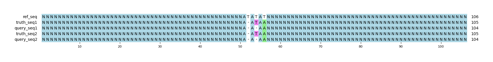

# Example `repr_bias_002a`
## Notes
This example was generated in conjunction with [repr_bias_002b](../repr_bias_002b) to demonstrate how variant representation can bias GT scoring.
In this example, the query variants are represented as individual small variants (SNP/indel).
When scored, both Hap.py and aardvark-GT both detect 1 TP SNV, 1 TP indel, and 1 FP indel.

This example was generated manually based on a real event in a tandem repeat within the human genome: `chr1:192,369,881-192,369,920`.

## Reference sequences
```
>mock
NNNNNNNNNNNNNNNNNNNNNNNNNNNNNNNNNNNNNNNNNNNNNNNNNN
ATATATNNNNNNNNNNNNNNNNNNNNNNNNNNNNNNNNNNNNNNNNNNNN
NNNNNNNNNNNNNNNNNNNNNNNNNNNNNNNNNNNNNNNNNNNNNNNNNN
```
## Truth variants
```
#CHROM	POS	ID	REF	ALT	QUAL	FILTER	INFO	FORMAT	truth
mock	51	.	AT	A	40	.	.	GT	1/1
mock	56	.	T	A	40	.	.	GT	1/1
```
## Query variants
```
#CHROM	POS	ID	REF	ALT	QUAL	FILTER	INFO	FORMAT	query
mock	51	.	AT	A	40	.	.	GT	1/1
mock	53	.	AT	A	40	.	.	GT	1/1
mock	56	.	T	A	40	.	.	GT	1/1
```
## Output summary
Variant Type | Metric | Hap.py-GT | Aardvark-GT | Aardvark-Basepair
:-- | :-- | --: | --: | --:
ALL | F1 | -- | 0.8 | 0.8
ALL | Recall | -- | 1.0 (2/2) | 1.0 (8/8)
ALL | Precision | -- | 0.6666666666666666 (2/3) | 0.6666666666666666 (8/12)
SNV | F1 | 1.0 | 1.0 | 1.0
SNV | Recall | 1.0 (1/1) | 1.0 (1/1) | 1.0 (4/4)
SNV | Precision | 1.0 (1/1) | 1.0 (1/1) | 1.0 (4/4)
INDEL | F1 | 0.666667 | 0.6666666666666666 | 0.6666666666666666
INDEL | Recall | 1.0 (1/1) | 1.0 (1/1) | 1.0 (4/4)
INDEL | Precision | 0.5 (1/2) | 0.5 (1/2) | 0.5 (4/8)
## MSA visualization

