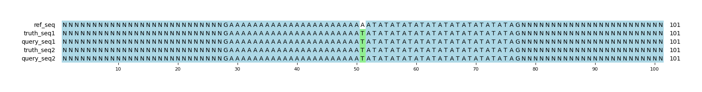

# Example `repr_bias_003a`
## Notes
This example was generated in conjunction with [repr_bias_003b](../repr_bias_003b) to demonstrate how variant representation can bias GT scoring.
In this example, the query variants exactly match the set of truth variants.
When scored, the GT counts a single TP for the SNVs and nothing for the indel types.

This example was generated manually based on a real event in a tandem repeat within the human genome: `chr1:192,369,881-192,369,920`.

## Reference sequences
```
>mock
NNNNNNNNNNNNNNNNNNNNNNNNNNNNNNNNNNNNNNNNNNNNNNNNNN
GAAAAAAAAAAAAAAAAAAAAAAAATATATATATATATATATATATATAG
NNNNNNNNNNNNNNNNNNNNNNNNNNNNNNNNNNNNNNNNNNNNNNNNNN
```
## Truth variants
```
#CHROM	POS	ID	REF	ALT	QUAL	FILTER	INFO	FORMAT	truth
mock	74	.	A	T	40	.	.	GT	1/1
```
## Query variants
```
#CHROM	POS	ID	REF	ALT	QUAL	FILTER	INFO	FORMAT	query
mock	74	.	A	T	40	.	.	GT	1/1
```
## Output summary
Variant Type | Metric | Hap.py-GT | Aardvark-GT | Aardvark-Basepair
:-- | :-- | --: | --: | --:
ALL | F1 | -- | 1.0 | 1.0
ALL | Recall | -- | 1.0 (1/1) | 1.0 (4/4)
ALL | Precision | -- | 1.0 (1/1) | 1.0 (4/4)
SNV | F1 | 1.0 | 1.0 | 1.0
SNV | Recall | 1.0 (1/1) | 1.0 (1/1) | 1.0 (4/4)
SNV | Precision | 1.0 (1/1) | 1.0 (1/1) | 1.0 (4/4)
INDEL | F1 | -- |  | 
INDEL | Recall | -- |  (0/0) |  (0/0)
INDEL | Precision | -- |  (0/0) |  (0/0)
## MSA visualization

