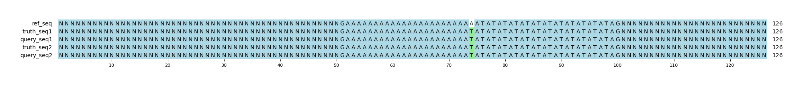

# Example `repr_bias_003b`
## Notes
This example was generated in conjunction with [repr_bias_003a](../repr_bias_003a) to demonstrate how variant representation can bias GT scoring.
In this example, the query variants are represented as two distinct indels.
While this representation is less succinct, variant callers that are short tandem repeat (STR) aware may be more likely to report this change as a contraction and expansion of the two STRs.
This representation generates a sequence that is still identical to the sequence from the single SNV.

When scored, both Hap.py and aardvark-GT label the truth variant as a TP SNV, and the two query variants as TP indels.
This creates a weighting bias in the results: the form in `repr_bias_003a` assigned the **1 query TP** to **SNV**, whereas this form assigned **2 query TP** to **indels**.
Despite representing the same genomic changes, these two representations are scored differently.

In contrast, the ALL basepair scoring is identical to the results of repr_bias_002a because the variants represent the same genomic changes.

This example was generated manually based on a real event in a tandem repeat within the human genome: `chr1:192,369,881-192,369,920`.

## Reference sequences
```
>mock
NNNNNNNNNNNNNNNNNNNNNNNNNNNNNNNNNNNNNNNNNNNNNNNNNN
GAAAAAAAAAAAAAAAAAAAAAAAATATATATATATATATATATATATAG
NNNNNNNNNNNNNNNNNNNNNNNNNNNNNNNNNNNNNNNNNNNNNNNNNN
```
## Truth variants
```
#CHROM	POS	ID	REF	ALT	QUAL	FILTER	INFO	FORMAT	truth
mock	74	.	A	T	40	.	.	GT	1/1
```
## Query variants
```
#CHROM	POS	ID	REF	ALT	QUAL	FILTER	INFO	FORMAT	query
mock	51	.	GAA	G	40	.	.	GT	1/1
mock	76	.	T	TAT	40	.	.	GT	1/1
```
## Output summary
Variant Type | Metric | Hap.py-GT | Aardvark-GT | Aardvark-Basepair
:-- | :-- | --: | --: | --:
ALL | F1 | -- | 1.0 | 1.0
ALL | Recall | -- | 1.0 (1/1) | 1.0 (4/4)
ALL | Precision | -- | 1.0 (2/2) | 1.0 (4/4)
SNV | F1 | 0.0 |  | 
SNV | Recall | 1.0 (1/1) | 1.0 (1/1) | 1.0 (4/4)
SNV | Precision | 0.0 (0/0) |  (0/0) |  (0/0)
INDEL | F1 | 0.0 |  | 
INDEL | Recall | 0.0 (0/0) |  (0/0) |  (0/0)
INDEL | Precision | 1.0 (2/2) | 1.0 (2/2) | 0.25 (4/16)
## MSA visualization

