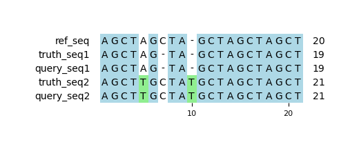

# Example `representation_mismatch_004`
## Reference sequences
```
>mock
AGCTAGCTAGCTAGCTAGCT
```
## Truth variants
```
#CHROM	POS	ID	REF	ALT	QUAL	FILTER	INFO	FORMAT	truth
mock	5	.	A	T	.	.	.	GT	0/1
mock	6	.	GC	G	.	.	.	GT	0/1
mock	9	.	A	AT	.	.	.	GT	0/1
```
## Query variants
```
#CHROM	POS	ID	REF	ALT	QUAL	FILTER	INFO	FORMAT	query
mock	4	.	TAG	TTG	.	.	.	GT	0/1
mock	5	.	AGC	AG	.	.	.	GT	0/1
mock	9	.	AG	ATG	.	.	.	GT	0/1
```
## Output summary
Variant Type | Metric | Hap.py-GT | Aardvark-GT | Aardvark-Basepair
:-- | :-- | --: | --: | --:
ALL | F1 | -- | 1.0 | 1.0
ALL | Recall | -- | 1.0 (3/3) | 1.0 (6/6)
ALL | Precision | -- | 1.0 (3/3) | 1.0 (6/6)
SNV | F1 | 1.0 |  | 
SNV | Recall | 1.0 (1/1) | 1.0 (1/1) | 1.0 (2/2)
SNV | Precision | 1.0 (1/1) |  (0/0) |  (0/0)
INDEL | F1 | 1.0 | 1.0 | 1.0
INDEL | Recall | 1.0 (2/2) | 1.0 (2/2) | 1.0 (4/4)
INDEL | Precision | 1.0 (2/2) | 1.0 (3/3) | 1.0 (6/6)
## MSA visualization

