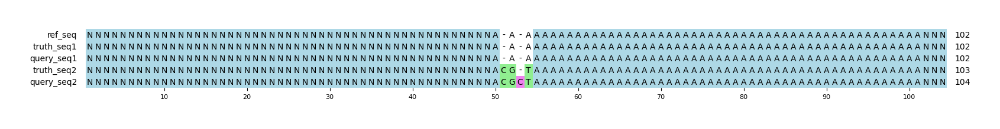

# Example `representation_mismatch_003`
## Reference sequences
```
>mock
NNNNNNNNNNNNNNNNNNNNNNNNNNNNNNNNNNNNNNNNNNNNNNNNNN
AAAAAAAAAAAAAAAAAAAAAAAAAAAAAAAAAAAAAAAAAAAAAAAAAA
NNNNNNNNNNNNNNNNNNNNNNNNNNNNNNNNNNNNNNNNNNNNNNNNNN
```
## Truth variants
```
#CHROM	POS	ID	REF	ALT	QUAL	FILTER	INFO	FORMAT	truth
mock	52	.	A	C	40	.	.	GT	0|1
mock	53	.	A	GT	40	.	.	GT	0|1
```
## Query variants
```
#CHROM	POS	ID	REF	ALT	QUAL	FILTER	INFO	FORMAT	query
mock	52	.	AA	CGCT	40	.	.	GT	0|1
```
## Output summary
Variant Type | Metric | Hap.py-GT | Aardvark-GT | Aardvark-Basepair
:-- | :-- | --: | --: | --:
ALL | F1 | -- | NaN | 0.8571428571428571
ALL | Recall | -- | 0.0 (0/2) | 1.0 (6/6)
ALL | Precision | -- | 0.0 (0/1) | 0.75 (6/8)
SNV | F1 | 0.666667 |  | 
SNV | Recall | 1.0 (1/1) | 0.0 (0/1) | 1.0 (2/2)
SNV | Precision | 0.5 (1/2) |  (0/0) |  (0/0)
INDEL | F1 |  | NaN | 0.8571428571428571
INDEL | Recall | 0.0 (0/1) | 0.0 (0/1) | 1.0 (4/4)
INDEL | Precision | 0.0 (0/1) | 0.0 (0/1) | 0.75 (6/8)
## MSA visualization

