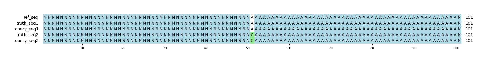

# Example `simple_snv_het`
## Notes
This is the simplest benchmark example one can expect: a single heterozygous SNV in a relatively isolated region.
On this page, we provide the core input information to understand each of these examples including:

* The reference genome sequence
* The truth VCF file entries
* The query VCF file entries
* A table showing the scoring outcomes from Hap.py, Aardvark-GT, and Aardvark-Basepair. This table is subdividing by variant type (SNV/indel), and "ALL" is also provided from Aardvark.

The scoring schemes for Hap.py and Aardvark-GT are analogous, and will often (though not always) be identical throughout these examples.
In contrast, the basepair scoring scheme is based on sequence-level differences between the reference genome, the truth haplotype sequenes, and the query haplotype sequences.
Additionally, the basepair scoring scheme has some interesting cases where partial credit for an individual base is possible (see [half_correct](../half_correct)).
Thus, all values are doubled for basepair to remove floating point calculations.
For example, there is only one affected base in this example, yet the Aardvark-Basepair recall is (2/2).

Given this simple example that is an exact match, we see that recall, precision, and F1 scores are all 1.0 across all assessments.

## Reference sequences
```
>mock
NNNNNNNNNNNNNNNNNNNNNNNNNNNNNNNNNNNNNNNNNNNNNNNNNN
AAAAAAAAAAAAAAAAAAAAAAAAAAAAAAAAAAAAAAAAAAAAAAAAAA
NNNNNNNNNNNNNNNNNNNNNNNNNNNNNNNNNNNNNNNNNNNNNNNNNN
```
## Truth variants
```
#CHROM	POS	ID	REF	ALT	QUAL	FILTER	INFO	FORMAT	truth
mock	51	.	A	C	40	.	.	GT	0/1
```
## Query variants
```
#CHROM	POS	ID	REF	ALT	QUAL	FILTER	INFO	FORMAT	query
mock	51	.	A	C	40	.	.	GT	0/1
```
## Output summary
Variant Type | Metric | Hap.py-GT | Aardvark-GT | Aardvark-Basepair
:-- | :-- | --: | --: | --:
ALL | F1 | -- | 1.0 | 1.0
ALL | Recall | -- | 1.0 (1/1) | 1.0 (2/2)
ALL | Precision | -- | 1.0 (1/1) | 1.0 (2/2)
SNV | F1 | 1.0 | 1.0 | 1.0
SNV | Recall | 1.0 (1/1) | 1.0 (1/1) | 1.0 (2/2)
SNV | Precision | 1.0 (1/1) | 1.0 (1/1) | 1.0 (2/2)
INDEL | F1 | -- |  | 
INDEL | Recall | -- |  (0/0) |  (0/0)
INDEL | Precision | -- |  (0/0) |  (0/0)
## MSA visualization

